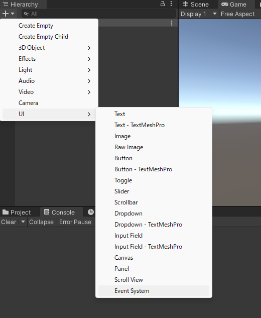
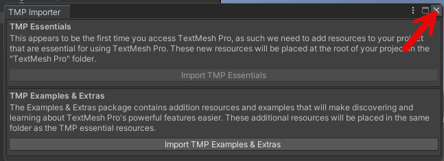

Hierarchy を確認します。

## EventSystem の配置

Hierarchy で上部の＋ボタンから UI > EventSystem を選択します。

EventSystem が配置されます。

## MainCamera に PhysicsRaycaster コンポーネントの配置

MainCamera をクリックします。

MainCamera を選択した状態で Inspector を確認して Add Component をクリックします。

コンポーネントの選択画面が出てきます。

検索エリアに PhysicsRaycaster を検索してクリックして選択します。

PhysicsRaycaster が追加されました。

## Cube の配置

Hierarchy で上部の＋ボタンから 3D Object > Cude の操作をして Cube オブジェクトを配置します。

Cube というオブジェクトが作成されます。

Cube を選択した状態で Inspector を確認して Add Component をクリックします。

New script をクリックします。

Name が聞かれるので NodeRedPostOpenAI と入力して Create and Add をクリックします。

コンポーネントが追加されたら、C# スクリプトを編集するために、こちらをダブルクリックします。

エディタが起動します。NodeRedPostOpenAI のスクリプトは以下を記述して保存します。

[csharp]
using UnityEngine;
using UnityEngine.EventSystems;

using System.Collections;
using UnityEngine.Networking;
using System.Text;

using System;
using TMPro;

public class NodeRedPostOpenAI : MonoBehaviour, IPointerClickHandler
{
    // アクセスする URL
    string urlNodeRed = "ここにサーバーURLを入れる";

    // 送信する Unity データを JSON データ化する RequestData ベースクラス
    [Serializable]
    public class RequestData
    {
        public string message;
    }

    void Start()
    {
        Debug.Log($"Start");
    }

    public void OnPointerClick(PointerEventData eventData)
    {
        // マウスクリックイベント
        Debug.Log($"オブジェクト {this.name} がクリックされたよ！");

        // HTTP GET リクエストを非同期処理を待つためコルーチンとして呼び出す
        StartCoroutine(PostNodeRed());
    }

    // POST リクエストする本体
    IEnumerator PostNodeRed()
    {
        // HTTP リクエストする(POST メソッド) UnityWebRequest を呼び出し
        // アクセスする先は変数 urlNodeRed で設定
        UnityWebRequest request = new UnityWebRequest(urlNodeRed, "POST");

        // JSON データ作成
        RequestData requestData = new RequestData();
        // 今回は英語であいさつ
        requestData.message = "Hello!";
        // 送信データを JsonUtility.ToJson で JSON 文字列を作成
        // RequestData, RequestDataMessages の構造に基づいて変換してくれる
        string strJSON = JsonUtility.ToJson(requestData);
        Debug.Log($"strJSON : {strJSON}");
        // 送信データを Encoding.UTF8.GetBytes で byte データ化
        byte[] bodyRaw = Encoding.UTF8.GetBytes(strJSON);
        // アップロード（Unity→サーバ）のハンドラを作成
        request.uploadHandler = new UploadHandlerRaw(bodyRaw);
        // ダウンロード（サーバ→Unity）のハンドラを作成
        request.downloadHandler = new DownloadHandlerBuffer();
        // JSON で送ると HTTP ヘッダーで宣言する
        request.SetRequestHeader("Content-Type", "application/json");

        // リクエスト開始
        yield return request.SendWebRequest();

        // 結果によって分岐
        switch (request.result)
        {
            case UnityWebRequest.Result.InProgress:
                Debug.Log("リクエスト中");
                break;

            case UnityWebRequest.Result.Success:
                Debug.Log("リクエスト成功");

                // コンソールに表示
                Debug.Log($"responseData: {request.downloadHandler.text}");

                // テキストに反映
                GameObject.Find("Text1").GetComponent<TextMeshPro>().text = request.downloadHandler.text;

                break;
        }

        request.Dispose();
    }

}
[/csharp]

保存できたら以下のコードに注目します。

[csharp]
    // アクセスする URL
    string urlNodeRED = "ここにサーバーURLを入れる";
[/csharp]

「ここにサーバーURLを入れる」の部分を、今回の URL http://127.0.0.1:1880/api/openai に変更しておきます。

## TextMeshPro の配置・調整

Hierarchy で上部の＋ボタンから 3D Object > Text - TextMeshPro を選択します。

TMP Importer が表示されるので Import TMP Essentials をクリックします。

読み込まれたら閉じます。

Text (TMP) という名前で TextMeshPro が配置されました。

Text (TMP) をクリックすると名前が編集できるので Text1 と入力します。

名前が変更できました。

このままだと、テキストが大きすぎるのでちょっと調整します。

引き続き Text1 を選択した状態で Inspector を確認し Rect Transform に注目します。

- Pos X : 0
- Pos Y : 3
- Pos Z : 0
- Scale X : 0.5
- Scale Y : 0.5
- Scale Z : 0.5

と入力します。

また、Font Size を 12 に変更します。

テキストがこのように配置されます。

これで Unity の準備はできました。

## この記事の注意点

今回はテキストの表示は英語のみが表示される TextMeshPro のデフォルトで行っています。そのため、質問内容も Hello! という英語です。

もしも、質問内容を日本語で質問してテキストで日本語を表示したい場合は、以下の記事などを参考に TextMeshPro のフォントを日本語適用してから質問内容を日本語にして試してみてください。

- \[Unity\] Text Mesh Proで日本語を表示する方法
  - https://zenn.dev/kametani256/articles/63c083ab318136
